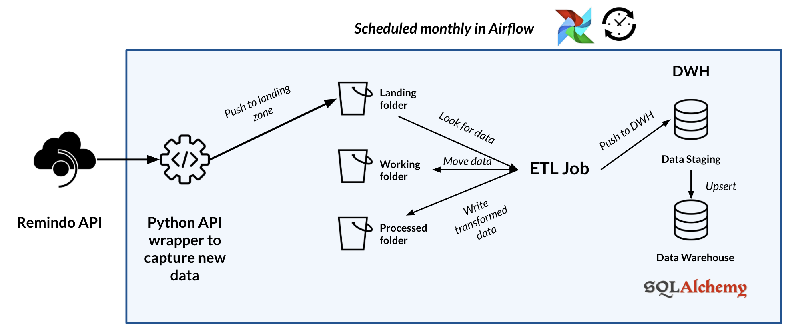

<!-- Parts of this template are inspired by https://github.com/othneildrew/Best-README-Template -->

# ETL on Remindo Toets with Airflow

<!-- Include Github badges here (optional) -->
<!-- e.g. Github Actions workflow status -->
<!-- -->

This repository contains two [Airflow](https://airflow.apache.org/) workflows (`dags`) that leverage [Remindo API](https://github.com/UtrechtUniversity/remindo-api) to extract, transform and load Utrecht University data from [Remindo Toets](https://www.paragin.nl/remindotoets/) to the on-premise datawarehouse of Utrecht University. The creation of the database schemas, loading, upserting and merging of data is done leveraging [SQLAlchemy](https://www.sqlalchemy.org/).

Airflow is used to schedule, monitor and start the repeated ETL of the most recent data from Remindo Toets.

<!-- TABLE OF CONTENTS -->
## Table of Contents

- [ETL on Remindo Toets with Airflow](#etl-on-remindo-toets-with-airflow)
  - [Table of Contents](#table-of-contents)
  - [About the Project](#about-the-project)
    - [Overview](#overview)
    - [ETL Flow](#etl-flow)
    - [Built with](#built-with)
    - [License](#license)
  - [Getting Started](#getting-started)
    - [Prerequisites](#prerequisites)
      - [Airflow setup](#airflow-setup)
      - [Hadoop setup](#hadoop-setup)
      - [Set up Spark](#set-up-spark)
    - [Installation](#installation)
    - [Start PostgreSQL](#start-postgresql)
    - [Start Airflow](#start-airflow)
    - [Stopping services](#stopping-services)
  - [TODO: Usage](#todo-usage)
  - [Contributing](#contributing)
  - [Notes](#notes)
    - [TODO: Testing the Limits](#todo-testing-the-limits)
  - [Contact](#contact)

<!-- ABOUT THE PROJECT -->
## About the Project

### Overview

Data is recurringly captured from the Remindo API using the Remindo Python wrapper (View usage - [Fetch Data Module](apiwrapperdocumentationlink)). The data collected from the [Remindo API]([internallink](https://github.com/UtrechtUniversity/remindo-api)) is stored on the local disk and is then moved to the Landing Zone. ETL jobs are written in spark and scheduled in airflow to run every 30 days.  

### ETL Flow



- Data Collected from the API is moved to landing zone.
- ETL job has copies data from landing zone to working zone.
- Once the data is moved to working zone, a job is triggered which reads the data from working zone and apply transformation. If Spark is enabled, the dataset is repartitioned and moved to the Processed Zone.
- Warehouse module of ETL jobs picks up data from processed zone and stages it into the Oracle DB staging tables.
- Using the Oracle staging tables and UPSERT (i.e. MERGE) operation is performed on the Data Warehouse tables to update the dataset.
- ETL job execution is completed once the Data Warehouse is updated.
- **TODO**: Airflow DAG runs the data quality check on all Warehouse tables once the ETL job execution is completed.
- **TODO**: Airflow DAG has Analytics queries configured in a Custom Designed Operator. These queries are run and again a Data Quality Check is done on some selected Analytics Table.
- **TODO**: Dag execution completes after these Data Quality check.

**Date**: February 2019

**Research Software Engineer(s)**:

- Leonardo Jaya Vida (l.j.vida@uu.nl)

### Built with

This project mainly leverages

- [Airflow](https://airflow.apache.org/)
- [SQLAlchemy](https://www.sqlalchemy.org/)

<!-- Do not forget to also include the license in a separate file(LICENSE[.txt/.md]) and link it properly. -->
### License

Currently, it is unsure what the license of the code in this project is.

<!-- GETTING STARTED -->
## Getting Started

Guide to get a local copy of this project up and running.

### Prerequisites

To install and run this project you need to have the following prerequisites installed.

- Airflow
- PostgreSQL

If you want to run the ETL jobs using Spark, you will also need to set up the following:

- Hadoop
- Spark

#### Airflow setup

Detailed instruction on how to setup Airflow are available [here](https://towardsdatascience.com/an-apache-airflow-mvp-complete-guide-for-a-basic-production-installation-using-localexecutor-beb10e4886b2) and [here](https://levelup.gitconnected.com/deploying-scalable-production-ready-airflow-in-10-easy-steps-using-kubernetes-4f449d01f47a) if a containarized solution is preferred.

In both recommendations, you need to modify the following when installing Airflow:

```bash
    # from
    pip install apache-airflow['postgresql']
    # to
    pip install 'apache-airflow[crypto, password, oracle]'
```

- Use a PostgreSQL database to manage Airflow's dags.

Finally, copy the dag and plugin [folder](dags) inside the Airflow home directory.

#### Hadoop setup

On `MacOS`:

- Install `brew` if you do not already have it
  - `/usr/bin/ruby -e "$(curl -fsSL https://raw.githubusercontent.com/Homebrew/install/master/install)"`
- Install Java (1.8)
  - `brew cask install homebrew/cask-versions/adoptopenjdk8`
- Install `Hadoop` using `brew`
  - `brew install hadoop`
- **Configure** Hadoop following this [guide from TowardsDataScience](https://towardsdatascience.com/installing-hadoop-on-a-mac-ec01c67b003c)

#### Set up Spark

- From terminal, install `Pyspark`
  - `pip install Pyspark`
- Setup environment variables. From terminal navigate to your `./zshrc` or `./bashrc` or `./bash_profile` depending on your OS.
Insert the following:

```bash
    export JAVA_HOME=<'path-to-apache-spark-bin'>
    export JRE_HOME=<'path-to-apache-spark-bin'>
    export SPARK_HOME=<'path-to-apache-spark-bin'>
    export PATH=<'path-to-apache-spark-bin'>
    export PYSPARK_DRIVER_PYTHON=python
    export PYSPARK_PYTHON=python
```

### Installation

To run the project, ensure to install the project's dependencies.

```sh
pip install -r requirements.txt
```

### Start PostgreSQL

Start the `PostgreSQL` server on which Airflow depends to run and schedule the jobs.

If you used `brew` to install PostgreSQL:

```bash
  brew services start postgres
```

else:

```bash
  services start postgres
```

### Start Airflow

Start Airflow `scheduler`, `webserver` (and `worker` if you set it up) with the following commands on your Terminal.

```python
  airflow start scheduler
  airflow start webserver
  #airflow start worker
```

### Stopping services

```python
  airflow stop scheduler
  airflow stop webserver
  #airflow stop worker
  
  # Now for the Server
  services stop postgres
  # OR
  brew services stop postgres
```

<!-- USAGE -->
## TODO: Usage

This section will describe how to run the project.

_For more examples, please refer to the [Documentation](sphinx-doc-website)_

<!-- CONTRIBUTING -->
## Contributing

Contributions are what make the open source community an amazing place to learn, inspire, and create. Any contributions you make are **greatly appreciated**.

To contribute:

1. Fork the Project
2. Create your Feature Branch (`git checkout -b feature/AmazingFeature`)
3. Commit your Changes (`git commit -m 'Add some AmazingFeature'`)
4. Push to the Branch (`git push origin feature/AmazingFeature`)
5. Open a Pull Request

<!-- NOTES -->
## Notes

### TODO: Testing the Limits

The `remindofaker` module in this project generates Fake data which is used to test the ETL pipeline on heavy load.  

<!-- CONTACT -->
## Contact

Leonardo Vida - [@leonardojvida](https://twitter.com/leonardojvida) - contact.rse@uu.nl

Project Link: [https://github.com/UtrechtUniversity/remindo-etl-airflow](https://github.com/UtrechtUniversity/remindo-etl-airflow)
